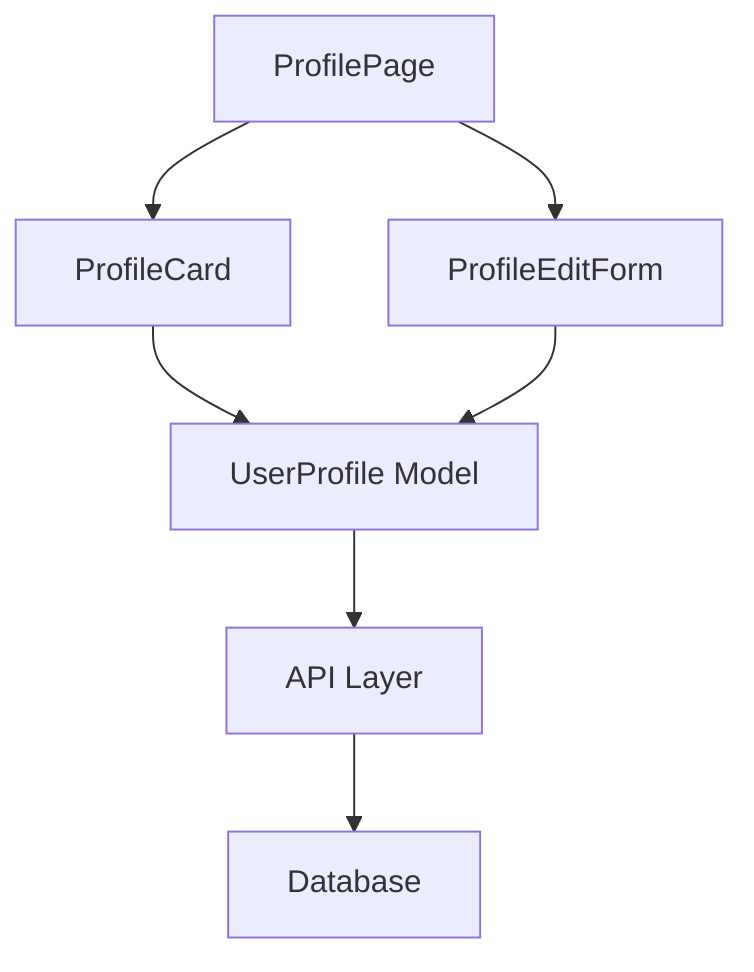

# Design: Example Feature - ユーザープロフィール表示

## Overview

ユーザープロフィール表示・編集機能の設計ドキュメント。
プロフィール情報の表示、編集、バリデーションの仕様を定めます。

## Architecture



## Components & Interfaces

### ProfilePage
ユーザープロフィールの全体ページ。プロフィール表示と編集機能を統合。

```typescript
interface ProfilePageProps {
  userId: string;
}
```

### ProfileCard
ユーザーのプロフィール情報を表示するカード。
- 名前、メール、アバター画像を表示
- アバター読み込み失敗時はプレースホルダーを表示
- 編集ボタンで編集フォームに遷移

```typescript
interface ProfileCardProps {
  user: UserProfile;
  onEdit: () => void;
}
```

### ProfileEditForm
プロフィール編集フォーム。
- フォームバリデーション機能
- サーバー側バリデーションエラーのハンドリング
- 変更内容の保存

```typescript
interface ProfileEditFormProps {
  user: UserProfile;
  onSave: (updatedUser: UserProfile) => Promise<void>;
  onCancel: () => void;
}
```

## Data Models

### UserProfile

```typescript
interface UserProfile {
  id: string;
  name: string;
  email: string;
  avatarUrl?: string;
  createdAt: Date;
  updatedAt: Date;
}

// バリデーションスキーマ（Zod例）
const userProfileSchema = z.object({
  name: z.string().min(1).max(100),
  email: z.string().email(),
  avatarUrl: z.string().url().optional()
});
```

## Requirements Traceability

| Requirement ID | Component | Description |
|---|---|---|
| 1.1 | ProfileCard | Display user's basic info (name, email, avatar) |
| 1.2 | ProfileCard | Show placeholder when avatar fails to load |
| 2.1 | ProfileEditForm | Display editable form with pre-filled data |
| 2.2 | ProfileEditForm | Save valid changes and show success message |
| 2.3 | ProfileEditForm | Display validation errors without losing data |

## Testing Strategy

### Unit Tests
- ProfileCard: Avatar fallback behavior
- ProfileEditForm: Form validation logic
- UserProfile: Schema validation

### Integration Tests
- End-to-end profile display and edit flow
- Server validation error handling
- Avatar image loading and fallback

### E2E Tests
- User navigates to profile page
- User edits profile and saves changes
- User sees validation errors and corrects them
