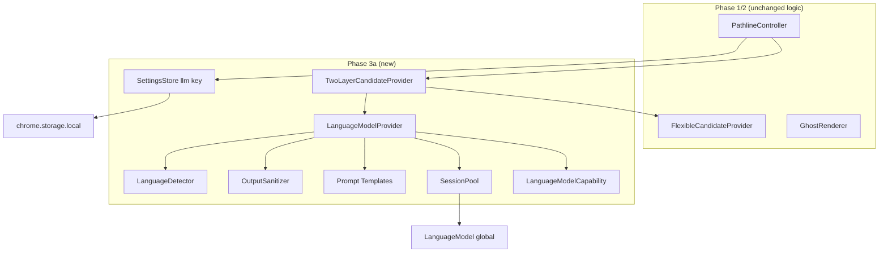
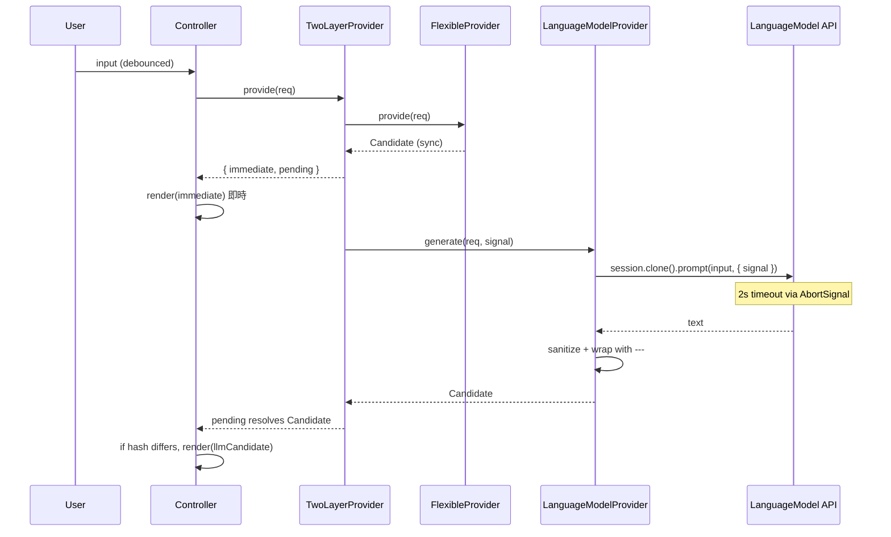
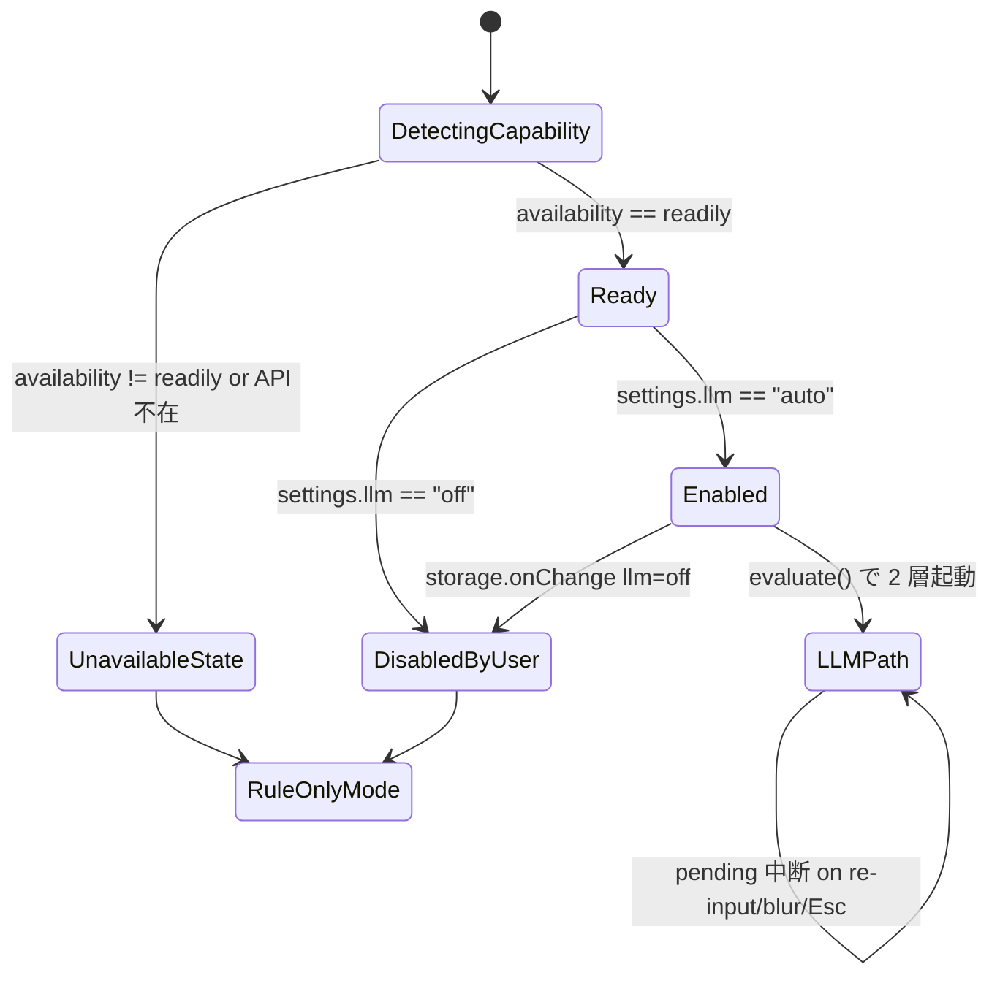

# Technical Design — Pathline Chrome Built-in AI (Phase 3a)

## Overview

**Purpose**: Chrome Built-in AI (Prompt API / `LanguageModel`) を用いた非同期 LLM 候補生成を Pathline に統合する。Phase 2 のルールベース候補 (`FlexibleCandidateProvider`) を即時表示しつつ、利用可能な環境では LLM が生成した高品質候補でゴーストを差し替える 2 層構造を実現する。

**Users**: Chrome 138+ で Gemini Nano が `readily` の環境を持つ Pathline ユーザー。他ブラウザや `unavailable` 環境では Phase 2 のままルールベースのみで動作する。

**Impact**: `CandidateProvider` インターフェースは無変更のまま、`TwoLayerCandidateProvider` (新規) が内部でルールベースと LLM の双方を統合。Controller の `evaluate()` にのみ「pending 候補の resolve 後差替え」ロジックを追加。

### Goals
- 要件 1〜8 をすべて満たす
- Phase 1/2 既存 124 テストを破壊しない
- ルールベース即時描画を 100ms 以内で維持 (要件 4.1)
- LLM 候補は 2 秒タイムアウトで中断可能、確実にキャンセル伝播
- gzip 増分 +2KB 以内 (要件 5.4)

### Non-Goals
- WebLLM / 他の LLM プロバイダ (Phase 3b)
- Streaming 応答の段階的描画 (Phase 3a では一括 `prompt()` のみ)
- 課金 / 認証 / backend (Phase 4 以降)
- 設定 UI の実装 (storage 直編集での切替のみ)
- モデル DL の明示的トリガ (要件 2.3 で `downloadable` 時は利用しない)

## Architecture

### Existing Architecture Analysis

Phase 2 は Logic 層内に `FlexibleCandidateProvider` を置き、Controller の DI で利用。Controller は `provide()` の戻り値を同期 `Candidate` として即 render する。

- 維持: ルールベース (`FlexibleCandidateProvider` 以下) / GhostRenderer / KeyboardHandler / DomWatcher / InputAdapter
- 拡張: `core/llm/` (Chrome Built-in AI アダプタ) と `core/twoLayer/` (2 層コンポジット) を追加
- 差し替え: Controller のデフォルト Provider を `TwoLayerCandidateProvider` に
- Controller 改修: pending 候補の追跡と差替え render (最小範囲)

### Architecture Pattern & Boundary Map



**Architecture Integration**:
- Selected pattern: **TwoLayer Composite** — 同期 Candidate + 非同期 Promise<Candidate> のペアを返す新型
- Domain boundaries: LLM アダプタは `core/llm/` に閉じ込め、Controller 側は pending Promise の追跡のみ
- Existing patterns preserved: `CandidateProvider`, `Candidate.hash`, GhostRenderer の dirty check
- New components rationale: Capability/Pool/Prompts/Sanitizer/LangDetect を分離し単体テスト可能化
- Steering compliance: 型安全、外部通信ゼロ、純関数優先

### Technology Stack

| Layer | Choice / Version | Role in Feature | Notes |
|-------|------------------|-----------------|-------|
| Runtime | Chrome Extension Manifest V3 (既存) | Content Script | 追加パーミッションなし |
| LLM | Chrome Built-in AI (`LanguageModel` global, Chrome 138+) | 候補生成 | 外部通信なし、完全ローカル |
| API | `LanguageModel.availability()` / `.create()` / `session.prompt({ signal })` | 可用性判定とプロンプト実行 | `AbortSignal.timeout(2000)` + `AbortSignal.any()` |
| Language | TypeScript 5.x strict | 全ソース | `any` 禁止継続 |
| Storage | `chrome.storage.local` | llm 設定 | 既存ストアを拡張 |

> 詳細の API 仕様と言語制約は `research.md` を参照。

## System Flows

### 2 層差替えシーケンス



### 可用性判定と設定評価



## Requirements Traceability

| Requirement | Summary | Components | Interfaces | Flows |
|-------------|---------|------------|------------|-------|
| 1.1 | LanguageModel API 存在確認 | LanguageModelCapability | `detect()` | 可用性判定 |
| 1.2 | availability() の取得 | LanguageModelCapability | `detect()` | — |
| 1.3 | API 不在時は unavailable 扱い | LanguageModelCapability | — | — |
| 1.4 | 例外時フォールバック | LanguageModelCapability | try/catch | — |
| 1.5 | 判定結果セッションキャッシュ | LanguageModelCapability | 内部 state | — |
| 2.1 | 可用時に非同期生成開始 | TwoLayerCandidateProvider, LanguageModelProvider | `provide(req)` | 2 層差替え |
| 2.2 | 成功時に Candidate 返却 | LanguageModelProvider | `generate(req, signal)` | — |
| 2.3 | downloadable/downloading はスキップ | TwoLayerCandidateProvider | capability 判定 | — |
| 2.4 | カテゴリ別 system prompt | PromptTemplates | `systemPrompt(category, lang)` | — |
| 2.5 | `---` 区切り付きユーザー prompt | PromptTemplates | `userPrompt(text)` | — |
| 2.6 | 出力 `---` 自動補完 | OutputSanitizer | `ensureFraming(body, text)` | — |
| 2.7 | 前置き語除去 | OutputSanitizer | `stripPreamble(body)` | — |
| 3.1 | 2 秒タイムアウト | LanguageModelProvider | `AbortSignal.timeout(2000)` | — |
| 3.2 | タイムアウトで中断 | LanguageModelProvider | AbortController | — |
| 3.3 | 再入力で旧中断 | PathlineController | pending tracker | — |
| 3.4 | blur で中断 | PathlineController | session disposables | — |
| 3.5 | 例外時は rule 維持 | LanguageModelProvider | try/catch | — |
| 4.1 | ルールベース 100ms 以内描画 | PathlineController | 既存パス | 2 層差替え |
| 4.2 | LLM 候補で差替え | PathlineController | pending resolve ハンドラ | — |
| 4.3 | 同 hash 時差替えない | GhostRenderer (既存) | dirty check | — |
| 4.4 | cycle 後も 2 層再実行 | PathlineController | onAction cycle 経路 | — |
| 4.5 | Tab は表示中候補を反映 | PathlineController | 既存 commit ハンドラ + visibleCandidate | — |
| 4.6 | Esc で pending 中断 | PathlineController | dismiss ハンドラ | — |
| 5.1 | 外部通信なし | 全体 | API 特性 | — |
| 5.2 | プロンプトを漏出しない | LanguageModelProvider | — | — |
| 5.3 | セッション再利用 | SessionPool | `get(category, lang)`, `clone()` | — |
| 5.4 | gzip +2KB 以内 | 全体 | 純 TS、辞書軽量 | — |
| 5.5 | MV3/permissions 据置 | manifest.json (無変更) | — | — |
| 6.1 | 日本語用 system prompt | PromptTemplates + LanguageDetector | `systemPrompt(category, "ja")` | — |
| 6.2 | 英語用 system prompt | PromptTemplates + LanguageDetector | `systemPrompt(category, "en")` | — |
| 6.3 | 中国語 (フォールバック解釈) | PromptTemplates | 中国語文字検知 → "respond in input's language" | — |
| 6.4 | 判定不能は ja 既定 | PromptTemplates | — | — |
| 6.5 | 言語ミスマッチでフォールバック | OutputSanitizer + LanguageDetector | `detect()` | — |
| 7.1 | storage キー llm 読み書き | SettingsStore (拡張) | `load()` 型拡張 | — |
| 7.2 | auto で LLM 有効 | PathlineController | mode 判定 | — |
| 7.3 | off で LLM 無効 | PathlineController | 早期 return | — |
| 7.4 | 不正値は auto | SettingsStore | validation | — |
| 7.5 | off 切替で pending 中断 | PathlineController | onChange handler | — |
| 8.1 | unavailable で Phase 2 維持 | TwoLayerCandidateProvider | 早期 return | — |
| 8.2 | 既存 124 テスト pass | — | — | — |
| 8.3 | CandidateProvider 型維持 | TwoLayerCandidateProvider | provide の戻り型拡張 (別名) | — |
| 8.4 | 既存 hash dirty check 利用 | GhostRenderer (既存) | — | — |
| 8.5 | flexible/classic と直交 | SettingsStore | mode と llm を独立 | — |

## Components and Interfaces

| Component | Domain/Layer | Intent | Req Coverage | Key Dependencies | Contracts |
|-----------|--------------|--------|--------------|------------------|-----------|
| LanguageModelCapability | LLM | API 存在判定と availability 取得 (キャッシュ) | 1.1–1.5 | `LanguageModel` global (P0) | Service, State |
| SessionPool | LLM | カテゴリ別ベースセッションの lazy 生成と clone() | 5.3 | Capability (P0), `LanguageModel` (P0) | Service, State |
| PromptTemplates | LLM | カテゴリ + 言語別の system/user prompt 生成 | 2.4, 2.5, 6.1–6.4 | — | Service (純関数) |
| OutputSanitizer | LLM | 前置き除去 + `---` framing 補完 + 言語検査 | 2.6, 2.7, 6.5 | LanguageDetector (P1) | Service (純関数) |
| LanguageDetector | LLM | 入力/出力の主要言語判定 (簡易) | 6.1–6.5 | — | Service (純関数) |
| LanguageModelProvider | LLM | 非同期 `generate(req, signal)` を提供 | 2.1, 2.2, 2.7, 3.1, 3.2, 3.5 | Capability (P0), Pool (P0), Prompts (P0), Sanitizer (P0) | Service |
| TwoLayerCandidateProvider | Logic | ルールベース + LLM のコンポジット。`{ immediate, pending }` を返す | 2.1, 2.3, 4.2, 8.1, 8.3 | FlexibleProvider (P0), LanguageModelProvider (P0), SettingsStore (P0) | Service |
| SettingsStore (拡張) | Persistence | `llm` キーを追加 (既存 `mode` と独立) | 7.1–7.5, 8.5 | chrome.storage.local (P1) | Service, State |
| PathlineController (改修) | Orchestration | `immediate` 即 render + `pending` 差替え | 3.3, 3.4, 4.1, 4.2, 4.4–4.6, 7.2, 7.3, 7.5 | TwoLayerProvider (P0), 既存全部品 | Service, State |

### LLM Layer

#### LanguageModelCapability

| Field | Detail |
|-------|--------|
| Intent | `LanguageModel` グローバルの存在確認と `availability()` 取得、結果キャッシュ |
| Requirements | 1.1, 1.2, 1.3, 1.4, 1.5 |

**Responsibilities & Constraints**
- `LanguageModel` が未定義の場合は `"unavailable"` を記録
- 初回 `detect()` のみ `availability()` を呼び、以降はキャッシュ
- 例外は握りつぶして `"unavailable"` 扱い、warn ログ出力のみ

**Dependencies**
- External: `LanguageModel` global (P0)

**Contracts**: Service ☑ / State ☑

##### Service Interface
```typescript
type AvailabilityStatus = "readily" | "after-download" | "downloading" | "unavailable";

interface CapabilityOptions {
  readonly inputLanguages: readonly string[]; // ["en","ja"] 既定
  readonly outputLanguages: readonly string[];
}

interface LanguageModelCapability {
  detect(options?: CapabilityOptions): Promise<AvailabilityStatus>;
  readonly cachedStatus: AvailabilityStatus | null;
}
```
- Preconditions: 初回 `detect()` 呼び出し時のみ実 API を問い合わせ
- Postconditions: 以降は `cachedStatus` を返す (再問い合わせなし)
- Invariants: `unavailable` にいったん落ちたら回復しない (セッション中)

#### SessionPool

| Field | Detail |
|-------|--------|
| Intent | カテゴリ別ベースセッションを lazy 生成し、都度 `clone()` した派生を払い出す |
| Requirements | 5.3 |

**Responsibilities & Constraints**
- `get(category)` で当該カテゴリのベースセッションを取得 (未生成なら `LanguageModel.create()` で初期化)
- 呼び出し側は `clone()` を使ってリクエスト単位の session を得る → `destroy()` で解放
- pool 自体の `dispose()` ですべてのベースセッションを `destroy()`

**Dependencies**
- Inbound: LanguageModelProvider (P0)
- External: `LanguageModel.create()` (P0)

**Contracts**: Service ☑ / State ☑

##### Service Interface
```typescript
interface BaseSession {
  clone(): Promise<LanguageModelSessionHandle>;
}

interface LanguageModelSessionHandle {
  prompt(input: string, options: { signal: AbortSignal }): Promise<string>;
  destroy(): void;
}

interface SessionPool {
  get(category: CategoryId): Promise<BaseSession>;
  dispose(): void;
}
```
- Preconditions: Capability が `readily` を返していること
- Postconditions: 同一カテゴリへの連続 `get()` は同一 BaseSession を返す
- Invariants: 生成失敗したカテゴリは以降 `get()` 時に再試行しない (同じエラーを即返す)

**Implementation Notes**
- Integration: LLM Provider から利用。コントローラは直接触らない
- Validation: `clone()` 後の `destroy()` 漏れがないようリクエスト毎の try/finally
- Risks: セッション無限生成 → Pool は 5 カテゴリ固定なので上限明確

#### PromptTemplates

| Field | Detail |
|-------|--------|
| Intent | カテゴリ + 検出言語から system prompt と user prompt を生成する純関数 |
| Requirements | 2.4, 2.5, 6.1, 6.2, 6.3, 6.4 |

**Contracts**: Service ☑

##### Service Interface
```typescript
type PromptLang = "ja" | "en" | "other";

interface PromptTemplates {
  systemPrompt(category: CategoryId, lang: PromptLang): string;
  userPrompt(text: string): string;
}
```
- Postconditions:
  - system prompt にカテゴリの主動詞 (改善 / 要約 / 整理 / 構造化 / レビュー) を含める
  - system prompt に "入力言語に一致した言語で返すこと" と "出力先頭に前置き語を付けないこと" を指示
  - user prompt は `---\n{text}\n---` 形式でテキストを包む
- Invariants: 同一 (category, lang) に対して同一 system prompt 文字列

#### LanguageDetector

| Field | Detail |
|-------|--------|
| Intent | 入力/出力の主要言語 (ja / en / other) を文字種で簡易判定 |
| Requirements | 6.1, 6.2, 6.3, 6.4, 6.5 |

**Contracts**: Service ☑

##### Service Interface
```typescript
interface LanguageDetector {
  detect(text: string): PromptLang; // "ja" | "en" | "other"
}
```
- 実装方針:
  - 日本語 Unicode ブロック (ひらがな/カタカナ) が閾値以上 → `"ja"`
  - ASCII ラテン文字のみかつ英語比率高 → `"en"`
  - それ以外 → `"other"`
- Postconditions: 決定論的。同一入力は同一結果

#### OutputSanitizer

| Field | Detail |
|-------|--------|
| Intent | LLM 出力から前置き除去と `---` framing 補完、言語ミスマッチ検知 |
| Requirements | 2.6, 2.7, 6.5 |

**Contracts**: Service ☑

##### Service Interface
```typescript
interface SanitizeResult {
  readonly body: string;
  readonly accepted: boolean; // 言語ミスマッチ時 false でフォールバック
}

interface OutputSanitizer {
  sanitize(llmOutput: string, originalText: string, inputLang: PromptLang): SanitizeResult;
}
```
- ロジック:
  1. 前置き語パターン (日英) を regex で除去
  2. 出力が `---\n{text}\n---` を含まなければ `${body}\n---\n${text}\n---` 形式に整形
  3. 入力が `"ja"` かつ出力に日本語文字 0 の場合 `accepted=false`
  4. それ以外は `accepted=true`
- Invariants: 純関数、決定論

#### LanguageModelProvider

| Field | Detail |
|-------|--------|
| Intent | AbortSignal 付きで 1 回の LLM 候補生成を行う非同期ポート |
| Requirements | 2.1, 2.2, 2.7, 3.1, 3.2, 3.5, 6.1–6.5 |

**Dependencies**
- Inbound: TwoLayerCandidateProvider (P0)
- Outbound: Capability (P0), SessionPool (P0), PromptTemplates (P0), OutputSanitizer (P0), LanguageDetector (P0)

**Contracts**: Service ☑

##### Service Interface
```typescript
interface LanguageModelProvider {
  generate(req: CandidateRequest, externalSignal?: AbortSignal): Promise<Candidate | null>;
}
```
- ロジック:
  1. Capability.detect が `readily` 以外なら `null`
  2. 入力言語 = LanguageDetector.detect(text)
  3. SessionPool から base session → `clone()` で派生
  4. `AbortSignal.any([AbortSignal.timeout(2000), externalSignal])` を合成
  5. `session.prompt(userPrompt, { signal })` を await
  6. OutputSanitizer でサニタイズ。`accepted===false` なら `null`
  7. body を `fnv1a(category + body)` で hash 化した Candidate を返す
  8. try/finally で派生 session を destroy()
- Postconditions: `null` 返却時は 2 層差替えをスキップ
- Invariants: 中断時は `AbortError` を catch して `null` 返却

**Implementation Notes**
- Integration: TwoLayerProvider の内部でのみ使用
- Validation: モック `LanguageModel` 実装で各分岐 (readily / timeout / abort / sanitize 拒否) を Unit Test
- Risks: `AbortSignal.any` 非対応 → Chrome 138+ 前提で許容、フォールバック polyfill 用意

### Logic Layer

#### TwoLayerCandidateProvider

| Field | Detail |
|-------|--------|
| Intent | ルールベース (同期) と LLM (非同期) を組み合わせ、Controller に 2 層候補を提供 |
| Requirements | 2.1, 2.3, 4.2, 8.1, 8.3 |

**Dependencies**
- Inbound: PathlineController (P0)
- Outbound: FlexibleCandidateProvider (P0), LanguageModelProvider (P0), SettingsStore (P0)

**Contracts**: Service ☑

##### Service Interface
```typescript
interface TwoLayerCandidate {
  readonly immediate: Candidate;
  readonly pending: Promise<Candidate | null>;
}

interface TwoLayerCandidateProvider {
  provide(req: CandidateRequest, signal: AbortSignal): TwoLayerCandidate;
}
```
- ロジック:
  1. `immediate = rule.provide(req)` (同期)
  2. Settings.llm が `off` → `pending = Promise.resolve(null)`
  3. Capability が `readily` でない → `pending = Promise.resolve(null)`
  4. それ以外 → `pending = llmProvider.generate(req, signal)`
- Postconditions: `immediate` は常に valid な Candidate、`pending` はキャンセル可能な Promise
- Invariants: `pending` の結果が resolve されるまで、再度 `provide()` を呼ぶ前に signal を abort することは Controller の責務

**Implementation Notes**
- Integration: Controller の evaluate() から呼ばれる
- Validation: モック Rule/LLM で各分岐を Unit Test
- Risks: pending を破棄し忘れてメモリリーク → Controller 側で request id 紐付けで破棄徹底

### Persistence Layer

#### SettingsStore (拡張)

| Field | Detail |
|-------|--------|
| Intent | 既存 `mode` に加え `llm: "auto" | "off"` を扱う |
| Requirements | 7.1–7.5, 8.5 |

**Contracts**: Service ☑ / State ☑

##### Service Interface
```typescript
type LLMSetting = "auto" | "off";

interface Settings {
  readonly mode: Mode;
  readonly llm: LLMSetting;
}

interface SettingsStore {
  load(): Promise<Settings>;
  onChange(listener: (s: Settings) => void): Disposable;
}
```
- Postconditions: `llm` 未定義または不正値は `"auto"`
- Invariants: `mode` (Phase 2) と `llm` (Phase 3a) は独立スイッチ (要件 8.5)

### Orchestration Layer

#### PathlineController (改修)

| Field | Detail |
|-------|--------|
| Intent | 既存機能に加え、`pending` 解決後のゴースト差替えと pending 中断を管理 |
| Requirements | 3.3, 3.4, 4.1, 4.2, 4.4, 4.5, 4.6, 7.2, 7.3, 7.5 |

**Responsibilities & Constraints**
- Session state に `pendingController: AbortController | null` と `visibleCandidate: Candidate | null` を追加
- `evaluate(session)`:
  1. 既存の `immediate` render に加え、`pending` を subscribe
  2. 新しい evaluate が走る前に古い `pendingController.abort()`
  3. `pending` の resolve 時、`Candidate` が非 null かつ `visibleCandidate.hash` と異なれば `renderer.render(target, llmCandidate)` して `visibleCandidate` を更新
  4. `null` resolve または AbortError は差替えなし
- `commit` アクション時は `visibleCandidate` を setText (従来は最新計算の candidate)。これにより要件 4.5 を満たす
- `blur` / `dismiss` 時は `pendingController.abort()`
- Settings の `onChange` で `llm` が `off` に変わったら進行中 pending を全セッションで abort

**Contracts**: Service ☑ / State ☑

**Implementation Notes**
- Integration: 最小改修のため、既存テストは破壊しない
- Validation: 新規テストで「pending resolve → 差替え render」「pending abort → 差替えなし」「llm=off 切替 → 即時 abort」を検証
- Risks: pending の race condition → requestId (単調増加) と AbortController の併用で明確化

## Data Models

### Domain Model
- `AvailabilityStatus` (enum): Chrome Built-in AI の 4 値
- `PromptLang` (enum): "ja" | "en" | "other"
- `LLMSetting` (enum): "auto" | "off"
- `TwoLayerCandidate` (値オブジェクト): `{ immediate, pending }`
- `SanitizeResult` (値オブジェクト): `{ body, accepted }`

### Logical Data Model
```typescript
interface Settings {
  readonly mode: "flexible" | "classic";
  readonly llm: "auto" | "off";
}
```
- `chrome.storage.local` に `mode` と `llm` の 2 キー

### Data Contracts & Integration
- 外部 API なし (Chrome Built-in AI はブラウザ内蔵、ネットワーク通信なし)
- `Candidate` / `CandidateRequest` は既存型をそのまま利用

## Error Handling

### Error Strategy
- **Fail-safe**: LLM 経路のあらゆる例外は catch して `null` を返し、ルールベース候補のまま維持
- **AbortError は正常系**: タイムアウト / 再入力 / blur / dismiss / off 切替で発生。warn ログ不要

### Error Categories and Responses
- **Capability 取得失敗**: `"unavailable"` 扱い、LLM 経路使用せず
- **Session 生成失敗**: Pool がエラーをキャッシュ、当該カテゴリは LLM 経路スキップ (warn 1 度のみ)
- **Prompt 実行失敗**: AbortError 以外は warn + `null` 返却
- **出力サニタイズ拒否 (言語ミスマッチ)**: `null` 返却、差替えなし

### Monitoring
- dev ビルドでは `performance.mark("pathline:llm:generate:start|end")` を計測
- `console.warn("[pathline] llm unavailable:", reason)` 初回のみ

## Testing Strategy

### テスト方針
- **LLM API はモック**: `LanguageModel` global をテスト内で差し替え可能な注入構造にする
- **純関数中心**: PromptTemplates / OutputSanitizer / LanguageDetector / Capability はモック不要で網羅テスト可能
- **TwoLayerProvider / Controller**: モック LLM Provider で分岐網羅
- 既存 124 テストは無変更 pass

### 1. Unit Tests

| テストID | 対象 | 観点 | テストケース | 期待 | 優先度 |
|----------|------|------|--------------|------|-------|
| UT-501 | LanguageModelCapability | 正常 | LanguageModel 不在 | unavailable | High |
| UT-502 | Capability | 正常 | availability() = readily | readily を返す | High |
| UT-503 | Capability | 異常 | availability() throw | unavailable | High |
| UT-504 | Capability | キャッシュ | 2 回目の detect() | API 呼び出しなし | Med |
| UT-510 | SessionPool | 正常 | 2 回同カテゴリ get | 同一 BaseSession | High |
| UT-511 | SessionPool | 正常 | clone + destroy のライフサイクル | destroy が呼ばれる | High |
| UT-512 | SessionPool | 異常 | create() throw | 以降同カテゴリで同エラー | Med |
| UT-520 | PromptTemplates | 正常 | 各カテゴリ × ja/en/other | 文字列内容を検証 | High |
| UT-521 | PromptTemplates | 決定論 | 同入力 | 同出力 | High |
| UT-530 | LanguageDetector | 正常 | ひらがな比率高 | ja | High |
| UT-531 | LanguageDetector | 正常 | ASCII のみ英文 | en | High |
| UT-532 | LanguageDetector | 正常 | 中国語混在 | other | Med |
| UT-540 | OutputSanitizer | 正常 | 前置き除去 | 前置きが消える | High |
| UT-541 | OutputSanitizer | 正常 | `---` 未含有 | framing 補完 | High |
| UT-542 | OutputSanitizer | 異常 | ja 入力に英語応答 | accepted=false | High |
| UT-543 | OutputSanitizer | 正常 | ja 入力 + ja 応答 | accepted=true | High |
| UT-550 | LanguageModelProvider | 正常 | readily で成功 | Candidate を返す | High |
| UT-551 | LanguageModelProvider | 境界 | タイムアウト | null 返却 | High |
| UT-552 | LanguageModelProvider | 境界 | external abort | null 返却 | High |
| UT-553 | LanguageModelProvider | 異常 | prompt throw | null, warn | High |
| UT-554 | LanguageModelProvider | 正常 | session destroy が finally で呼ばれる | destroy called | High |
| UT-560 | TwoLayerCandidateProvider | 正常 | llm=off | pending=null | High |
| UT-561 | TwoLayerCandidateProvider | 正常 | capability=unavailable | pending=null | High |
| UT-562 | TwoLayerCandidateProvider | 正常 | 通常経路 | immediate 即時 + pending resolve | High |
| UT-570 | SettingsStore | 正常 | llm=off 読み込み | 返却値に反映 | High |
| UT-571 | SettingsStore | 正常 | 不正値は auto | — | Med |
| UT-580 | Controller | 正常 | pending resolve で差替え | render 2 回 | High |
| UT-581 | Controller | 正常 | 同 hash なら差替えなし | render 1 回 | High |
| UT-582 | Controller | 正常 | 再入力で旧 pending abort | AbortController.abort called | High |
| UT-583 | Controller | 正常 | blur で pending abort | — | High |
| UT-584 | Controller | 正常 | Esc で pending abort | — | High |
| UT-585 | Controller | 正常 | Tab commit は visibleCandidate 使用 | setText が LLM 候補で呼ばれる | High |
| UT-586 | Controller | 正常 | llm=off onChange で pending abort | — | Med |

**観点**: 正常 / 異常 / 境界 / キャンセル / キャッシュ ✓

### 2. Integration Tests

| ID | 対象 | シナリオ | 期待 |
|----|------|----------|------|
| IT-501 | TwoLayerProvider 実 Rule + モック LLM | 「議事録を要約」 | immediate は Rule 出力、pending は LLM モック出力 |
| IT-502 | Controller + TwoLayerProvider | 入力 → render → 2 秒以内に LLM render | render が 2 回呼ばれる |
| IT-503 | Controller (llm=off) | 入力 → render | render 1 回のみ |

### 3. E2E / Manual
- **MT-301**: 実 Chrome 138+ 環境で debug ページ入力 → ルール候補が先、LLM 候補で差し替わることを目視
- **MT-302**: ネットワーク切断状態でも動作することを目視 (完全ローカル確認)
- **MT-303**: 設定 `llm=off` を storage に直書き → LLM 経路が走らないことを目視

### 4. Performance
| ID | 対象 | 目標 |
|----|------|------|
| PT-301 | ルールベース即時描画 | 100ms 以内 (既存目標) |
| PT-302 | LLM 生成総時間 | 2 秒以内 (タイムアウト上限) |
| PT-303 | gzip バンドルサイズ増分 | +2KB 以内 |

### テストカバレッジ目標
| レベル | 目標 |
|--------|------|
| Unit | 90% (LLM 層は 100%) |
| Integration | 主要パイプライン 100% |
| E2E | 3 手動シナリオ |

## Security Considerations
- 外部通信ゼロ (要件 5.1): `LanguageModel` はローカル推論のみ、ESLint の `no-restricted-globals` による `fetch` 禁止を継続
- ログ出力にプロンプトを含めない (要件 5.2): warn メッセージは理由文字列のみ
- 新規パーミッションなし (要件 5.5): `storage` のみで動作

## Performance & Scalability
- ルールベース描画: 既存の debounce 150ms + 処理 20ms 予算を維持 (要件 4.1)
- LLM 生成: 2 秒上限 + タイムアウトで必ず解放
- セッション再利用: カテゴリごとに 1 ベースセッション + 都度 clone/destroy (要件 5.3)
- バンドルサイズ: LLM 層は純粋 TS、辞書不要。gzip 増分を +2KB 以内に (要件 5.4)

## Supporting References
- `research.md` — Chrome Built-in AI API 仕様の詳細と決定事項
- `.kiro/specs/pathline-flexible-recommendation/design.md` — Phase 2 設計
- Chrome Developers: Prompt API 公式ドキュメント
