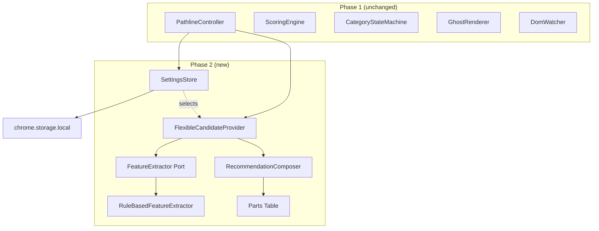
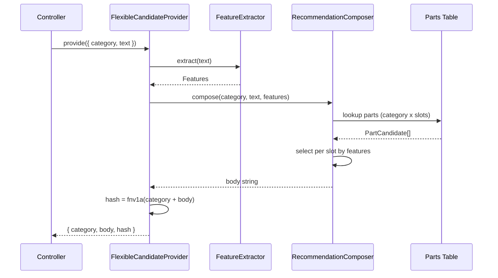
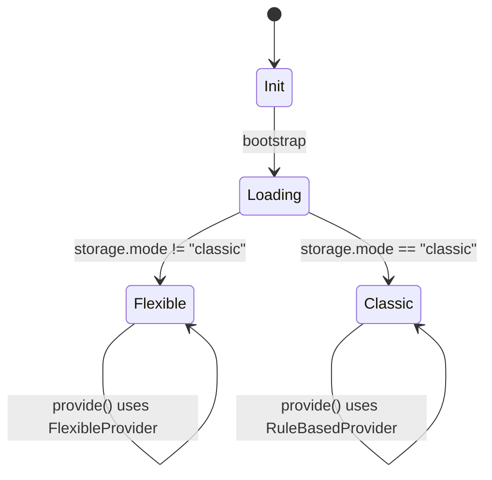

# Technical Design — Pathline Flexible Recommendation

## Overview

**Purpose**: 入力テキストから抽出した特徴量 (対象種別 / トーン / 出力形式希望 / 長さ制約 / 焦点候補) に基づき、5 カテゴリ (Improve / Summarize / Clarify / Structure / Review) の依頼文をテーブル駆動の 5 部品 (前置き / 焦点 / 制約 / 出力形式 / 締め) で動的に組み立てる。

**Users**: Phase 1 を導入済みの既存 Pathline ユーザー。設定変更なしに、より文脈に即した依頼文プレビューを得る。

**Impact**: 既存 `CandidateProvider` の MVP 実装 (`RuleBasedCandidateProvider`) を新実装 (`FlexibleCandidateProvider`) に差し替える。Controller / GhostRenderer / Scoring / StateMachine は無変更。

### Goals
- 要件 1〜6 をすべて満たす
- 既存 69 テストを維持しつつ、新規 30+ テストで Phase 2 ロジックを担保
- 体感 100ms 以下 (Composer 処理 < 10ms / 1000 文字)
- bundle 増分 +3KB 以内 (gzip)

### Non-Goals
- 形態素解析 / 機械学習モデルの組込
- 多言語 (英文/中文等) 対応
- 設定 UI の実装 (storage 直編集での切替のみ提供)
- AI 候補生成 (Phase 3)

## Architecture

### Existing Architecture Analysis

Phase 1 は Layered Modular Monolith + Ports & Adapters で構築済み。本フェーズは **Logic 層 (`src/core/`) の Candidate 生成系のみ拡張**する。境界は変更しない。

- 維持: DOM / View / Input / Orchestration 層は無変更
- 維持: `CandidateProvider` インターフェースと `Candidate` 値オブジェクト
- 拡張: `core/feature/` (特徴抽出) と `core/compose/` (部品組み立て) を追加
- 差し替え: Controller のデフォルト Provider を `FlexibleCandidateProvider` に
- 設定: `chrome.storage.local` から mode を読む `SettingsStore` を新設

### Architecture Pattern & Boundary Map



**Architecture Integration**:
- Selected pattern: 既存 Layered Modular Monolith を踏襲、Logic 層内に Ports (`FeatureExtractor`) を追加
- Domain/feature boundaries: Composer は純関数、Settings は I/O 境界、Provider は両者を結合する Adapter
- Existing patterns preserved: `CandidateProvider`, `Candidate.hash` による再描画抑止
- New components rationale: 拡張性 (要件 6) のため Extractor をポート化、テーブル駆動でテンプレ部品を集約
- Steering compliance: TypeScript strict / 型安全 / 純関数優先 / 外部通信ゼロ

### Technology Stack

| Layer | Choice / Version | Role in Feature | Notes |
|-------|------------------|-----------------|-------|
| Logic | TypeScript 5.x | Feature 抽出 / 部品組み立て | 純関数中心、外部依存追加なし |
| Storage | `chrome.storage.local` | mode 設定 | 既存 `permissions: ["storage"]` 内で対応 |
| Testing | Vitest + happy-dom | 純関数の網羅テスト | 既存基盤を踏襲 |

> 形態素解析ライブラリ等の追加は無し (詳細は `research.md`)。

## System Flows

### 候補生成シーケンス (mode=flexible)



### Mode 判定フロー



## Requirements Traceability

| Requirement | Summary | Components | Interfaces | Flows |
|-------------|---------|------------|------------|-------|
| 1.1 | 対象種別の推定 | RuleBasedFeatureExtractor | `extract(text): Features` | 候補生成 |
| 1.2 | トーン推定 | RuleBasedFeatureExtractor | `extract` | — |
| 1.3 | 出力形式推定 | RuleBasedFeatureExtractor | `extract` | — |
| 1.4 | 長さ制約 concise | RuleBasedFeatureExtractor | `extract` | — |
| 1.5 | 長さ制約 detailed | RuleBasedFeatureExtractor | `extract` | — |
| 1.6 | 焦点候補抽出 (最大3) | RuleBasedFeatureExtractor | `extract` | — |
| 1.7 | 5ms 以内 | RuleBasedFeatureExtractor | — | — |
| 1.8 | 短い入力は空集合 | RuleBasedFeatureExtractor | — | — |
| 2.1 | 5 部品で組み立て | RecommendationComposer | `compose(cat, text, features)` | 候補生成 |
| 2.2 | code 対象を前置きへ | RecommendationComposer + PartsTable | — | — |
| 2.3 | 議事録対象を前置きへ | RecommendationComposer + PartsTable | — | — |
| 2.4 | 焦点語を組込 | RecommendationComposer | — | — |
| 2.5 | concise 表現 | RecommendationComposer + PartsTable | — | — |
| 2.6 | detailed 表現 | RecommendationComposer + PartsTable | — | — |
| 2.7 | bullets 形式 | RecommendationComposer + PartsTable | — | — |
| 2.8 | table 形式 | RecommendationComposer + PartsTable | — | — |
| 2.9 | カテゴリ主動詞 | PartsTable | — | — |
| 2.10 | `---` 区切り埋込 | RecommendationComposer | — | — |
| 2.11 | 空 features は基本テンプレ | RecommendationComposer | — | — |
| 3.1 | 部品順固定 | RecommendationComposer | slot order constant | — |
| 3.2 | 同入力同出力 | FlexibleCandidateProvider, Composer | 純関数性 | — |
| 3.3 | 変化点最小 | RecommendationComposer | priority based selection | — |
| 3.4 | 決定論性 | Composer + Extractor | 純関数 | — |
| 4.1 | 10ms 以内 | Provider | パフォーマンス予算 | — |
| 4.2 | 外部通信なし | 全体 | manifest 据置 | — |
| 4.3 | 同期処理 | Provider | sync 戻り | — |
| 4.4 | MV3 据置 | manifest.json | — | — |
| 4.5 | +3KB 以内 | 全体 | 純関数 + 小辞書 | — |
| 5.1 | CandidateProvider 互換 | FlexibleCandidateProvider | `provide(req)` | — |
| 5.2 | Scoring/State 無変更 | — | — | — |
| 5.3 | classic mode 互換 | SettingsStore + Controller | mode switch | mode 判定 |
| 5.4 | カテゴリ ID 維持 | categories.ts (無変更) | — | — |
| 5.5 | 既存 69 テスト pass | — | — | — |
| 6.1 | Feature schema 集約 | features/types.ts | `Features` 型 | — |
| 6.2 | 部品差し替え可能 | parts/index.ts | `PartsTable` 定数 | — |
| 6.3 | Phase 3 AI 互換 | CandidateProvider 既存ポート | Promise 戻り対応済 | — |
| 6.4 | Extractor ポート化 | FeatureExtractor インターフェース | `extract` | — |

## Components and Interfaces

| Component | Domain/Layer | Intent | Req Coverage | Key Dependencies | Contracts |
|-----------|--------------|--------|--------------|------------------|-----------|
| FeatureExtractor (Port) | Logic | 入力から特徴量を抽出する抽象 | 1.1–1.8, 6.4 | — | Service |
| RuleBasedFeatureExtractor | Logic | 文字列パターンと小辞書での MVP 実装 | 1.1–1.8 | Feature schema (P0) | Service |
| PartsTable | Logic | カテゴリ × スロット × 候補のテーブル | 2.1–2.9, 6.2 | — | Data |
| RecommendationComposer | Logic | features と category から body を生成 | 2.1–2.11, 3.1, 3.3, 3.4 | PartsTable (P0) | Service |
| FlexibleCandidateProvider | Logic | Extractor + Composer + hash の Adapter | 2.1, 3.2, 5.1 | Extractor (P0), Composer (P0) | Service |
| SettingsStore | Persistence | mode 等の設定を chrome.storage から読む | 5.3 | chrome.storage.local (P1) | Service, State |

### Logic Layer

#### FeatureExtractor (Port)

| Field | Detail |
|-------|--------|
| Intent | 入力テキストから決定論的に特徴量を抽出する純関数ポート |
| Requirements | 1.1, 1.2, 1.3, 1.4, 1.5, 1.6, 1.7, 1.8, 6.4 |

**Responsibilities & Constraints**
- 純関数 (副作用なし)
- 5ms 以内 (1000 文字入力時) で完了
- 入力長が最小しきい値 (4 文字) 未満のとき空 Features を返す

**Dependencies**
- 外部依存なし (Port)

**Contracts**: Service ☑

##### Service Interface
```typescript
type TargetKind =
  | "code"
  | "prose"
  | "meeting_minutes"
  | "spec"
  | "proposal"
  | "question"
  | "unknown";

type Tone = "formal" | "casual" | "neutral";

type OutputFormat = "free" | "bullets" | "table" | "code" | "unknown";

type LengthHint = "concise" | "detailed" | "unspecified";

interface Features {
  readonly target: TargetKind;
  readonly tone: Tone;
  readonly format: OutputFormat;
  readonly length: LengthHint;
  readonly focus: readonly string[]; // 最大 3 件
  readonly empty: boolean; // 入力が短く特徴抽出を行わなかった場合 true
}

interface FeatureExtractor {
  extract(text: string): Features;
}
```
- Preconditions: `text` は string (空文字許容)
- Postconditions: 同一 `text` に対して常に同一 `Features` を返す
- Invariants: `focus.length <= 3`、`empty === true` の場合 `target = "unknown"`, `tone = "neutral"`, `format = "unknown"`, `length = "unspecified"`, `focus = []`

#### RuleBasedFeatureExtractor

| Field | Detail |
|-------|--------|
| Intent | 文字列パターンと小規模辞書での MVP 実装 |
| Requirements | 1.1–1.8 |

**Responsibilities & Constraints**
- 入力先頭 10_000 文字までを評価 (Phase 1 と同じ切出し)
- 辞書は readonly 配列で `src/core/feature/rules.ts` に集約
- ルール例:
  - 対象: `{ }`, `;`, `=`, `function`, `class`, `import` 等で `code`、「議事録」「アジェンダ」「決定事項」で `meeting_minutes` など
  - トーン: 「です/ます」連続で `formal`、「だよ」「じゃん」で `casual`、それ以外 `neutral`
  - 形式: 「箇条書き」「リストで」で `bullets`、「表で」「テーブル」で `table`
  - 長さ: 「簡潔」「短く」「N行」「N文字以内」で `concise`、「詳しく」「丁寧に」「網羅的」で `detailed`
  - 焦点: 正規表現で「英数字 + ドット/アンダースコアを含む 4-16 文字語」「カタカナ 4-16 連続」「鍵括弧内」を抽出 → 重複除去 → 上位 3 件
- しきい値: トーン語 2 件以上で確定、それ未満は `neutral`

**Dependencies**
- 外部依存なし

**Contracts**: Service ☑

##### Service Interface
```typescript
class RuleBasedFeatureExtractor implements FeatureExtractor {
  extract(text: string): Features;
}
```

**Implementation Notes**
- Integration: `FlexibleCandidateProvider` のコンストラクタ DI で注入。
- Validation: 各 TargetKind / Tone / OutputFormat / LengthHint に対応する Unit Test (UT-101 〜 UT-130)。
- Risks: 短い英文入力で誤検知 (例: ";" 含むだけで code 判定) → 単独記号は除外する閾値 (連続 2 文字以上で適用) を設ける。

#### PartsTable

| Field | Detail |
|-------|--------|
| Intent | カテゴリ × スロット の部品候補集合をデータとして提供 |
| Requirements | 2.1–2.9, 6.2 |

**Contracts**: Data (定数として export)

##### Data Definition
```typescript
type SlotId = "intro" | "focus" | "constraint" | "format" | "closing";

interface PartCandidate {
  readonly id: string;
  readonly text: string; // ${focus} 等のプレースホルダを含むことがある
  readonly when: (f: Features) => boolean; // 選択条件
  readonly priority: number; // 大きいほど優先
}

type PartsTable = Readonly<Record<CategoryId, Readonly<Record<SlotId, readonly PartCandidate[]>>>>;
```
- スロット順 (固定): `intro → focus → constraint → format → closing`
- 各スロットには 0..1 件が選ばれる (`when(f) === true` の中で `priority` 最大)。該当なしなら null
- `text` 内のプレースホルダ:
  - `${focus}` → features.focus を「、」連結
  - 他のプレースホルダは現状なし

**Implementation Notes**
- Integration: `compose()` から readonly でアクセス
- Validation: 各カテゴリで 5 部品分の候補が最低 1 件以上存在することを Unit Test で保証
- Risks: 部品の組合せで重複表現 (例: 前置きで「コード」、焦点でも「コード」) → 部品定義時に重複表現を避けるレビュー

#### RecommendationComposer

| Field | Detail |
|-------|--------|
| Intent | category + text + features から body 文字列を組み立てる純関数 |
| Requirements | 2.1, 2.2, 2.3, 2.4, 2.5, 2.6, 2.7, 2.8, 2.9, 2.10, 2.11, 3.1, 3.3, 3.4 |

**Responsibilities & Constraints**
- 純関数。同入力 → 同出力
- スロット順固定で各スロット 1 件選択 (なければ skip)
- features.empty が true の場合は MVP 互換の基本テンプレ (`buildTemplate` 同等) を返す
- 末尾に `\n---\n${text}\n---` を付与 (要件 2.10)

**Dependencies**
- Outbound: PartsTable (P0)

**Contracts**: Service ☑

##### Service Interface
```typescript
interface RecommendationComposer {
  compose(category: CategoryId, text: string, features: Features): string;
}
```
- Preconditions: text.length >= 0 (空文字許容、空時はテンプレのみ生成)
- Postconditions: 戻り値は必ず `template + "\n---\n" + text + "\n---"` 形式 (template はスロット連結結果)
- Invariants: 同一 `(category, text, features)` に対して同一文字列

**Implementation Notes**
- Integration: `FlexibleCandidateProvider` から呼び出し
- Validation: 代表入力 30 件のスナップショットテスト + Unit Test (UT-201 〜 UT-220)
- Risks: 部品連結が句読点不整合 → 各部品は文末に句点 (。) を含む規約とし、連結時はそのまま結合

#### FlexibleCandidateProvider

| Field | Detail |
|-------|--------|
| Intent | Extractor + Composer + hash 計算をまとめ、既存 `CandidateProvider` 互換で公開 |
| Requirements | 2.1, 3.2, 5.1 |

**Responsibilities & Constraints**
- 同期処理で `Candidate` を返す (要件 4.3)
- hash は `fnv1a(category + body)` (Phase 1 と同形式)

**Dependencies**
- Inbound: PathlineController (P0)
- Outbound: FeatureExtractor (P0), RecommendationComposer (P0)

**Contracts**: Service ☑

##### Service Interface
```typescript
class FlexibleCandidateProvider implements CandidateProvider {
  constructor(extractor: FeatureExtractor, composer: RecommendationComposer);
  provide(req: CandidateRequest): Candidate;
}
```
- Postconditions: 戻り値は同期 `Candidate`。`hash` は body から決定論的
- Invariants: 同一 `req` (category, text) かつ同一 extractor/composer に対して同一 `Candidate`

**Implementation Notes**
- Integration: Controller の DI で `RuleBasedCandidateProvider` から差し替え
- Risks: なし (既存 API 互換)

### Persistence Layer

#### SettingsStore

| Field | Detail |
|-------|--------|
| Intent | `chrome.storage.local` から mode を読み出す簡易ストア |
| Requirements | 5.3 |

**Responsibilities & Constraints**
- 起動時に 1 回読み込み (キャッシュ)
- 値が無い場合は `flexible` を既定
- storage 変更 (`chrome.storage.onChanged`) で再読み込みし、Controller に通知

**Contracts**: Service ☑ / State ☑

##### Service Interface
```typescript
type Mode = "flexible" | "classic";

interface SettingsStore {
  load(): Promise<{ mode: Mode }>;
  onChange(listener: (mode: Mode) => void): Disposable;
}
```
- Preconditions: `chrome.storage.local` 利用可能
- Postconditions: 不正値は `flexible` にフォールバック

**Implementation Notes**
- Integration: Controller `bootstrap()` で `await load()`、結果に応じて Provider を選択
- Validation: storage モック経由の Unit Test (UT-301 〜 UT-303)
- Risks: storage 読み込みの非同期性で初回 100ms 程度のラグ → 初回は flexible を仮定して即起動、storage 解決後に必要なら provider を入れ替える

## Data Models

### Domain Model
- `Features` (値オブジェクト): 入力解析結果の不変表現
- `PartCandidate` (値オブジェクト): スロット内候補
- `PartsTable` (静的マスタ): 全カテゴリ全スロットの候補集合
- `Mode` (列挙): `"flexible" | "classic"`

### Logical Data Model
```typescript
interface Features {
  readonly target: TargetKind;
  readonly tone: Tone;
  readonly format: OutputFormat;
  readonly length: LengthHint;
  readonly focus: readonly string[];
  readonly empty: boolean;
}

interface SettingsState {
  mode: Mode;
}
```
**Consistency & Integrity**:
- Features は Provider 内ローカルで生成・破棄。永続化なし
- Settings は `chrome.storage.local` に `{ mode: Mode }` の 1 キーで保存

### Data Contracts & Integration
- 外部 API なし
- 既存 `Candidate` 値オブジェクトは無変更

## Error Handling

### Error Strategy
- Fail-silent: Extractor/Composer 内例外は catch して既定 Features / 既定テンプレに fallback
- SettingsStore の storage 読み込み失敗時は flexible 既定で続行

### Error Categories and Responses
- **Logic Errors**: features 解析中の予期せぬ throw → empty Features に fallback、`console.warn("[pathline] feature fallback", err)`
- **Storage Errors**: storage アクセス例外 → flexible 既定で続行
- **Composition Errors**: 部品テーブル不整合 (空配列等) → MVP 基本テンプレに fallback (要件 2.11 と同じ経路)

### Monitoring
- dev ビルドのみ `performance.mark("pathline:flex:extract|compose")` を計測

## Testing Strategy

### テスト方針
- Logic 層は純関数中心。網羅 Unit Test を必須とする
- Composer はスナップショット + 個別アサーションのハイブリッド
- 既存 69 テストは無変更で pass を維持 (要件 5.5)

### 1. Unit Tests

| テストID | テスト対象 | 観点 | テストケース | 期待 | 優先度 |
|----------|-----------|------|--------------|------|-------|
| UT-101 | RuleBasedFeatureExtractor.extract | 正常 | コード片 (`function f(){}`) | target=code | High |
| UT-102 | extract | 正常 | 議事録 (「議事録」「決定事項」含む) | target=meeting_minutes | High |
| UT-103 | extract | 正常 | 仕様文 (「仕様」「要件」) | target=spec | High |
| UT-104 | extract | 正常 | 提案 (「提案」「案として」) | target=proposal | Med |
| UT-105 | extract | 正常 | 質問 (「?」「どう」) | target=question | Med |
| UT-106 | extract | 境界 | 4 文字未満 | empty=true、全フィールド既定 | High |
| UT-110 | extract (tone) | 正常 | 「です/ます」2 件以上 | tone=formal | High |
| UT-111 | extract (tone) | 正常 | 「だよ」「じゃん」 | tone=casual | Med |
| UT-112 | extract (tone) | 境界 | tone 語 1 件のみ | tone=neutral | Med |
| UT-115 | extract (format) | 正常 | 「箇条書き」 | format=bullets | High |
| UT-116 | extract (format) | 正常 | 「表で」 | format=table | High |
| UT-120 | extract (length) | 正常 | 「簡潔に」 | length=concise | High |
| UT-121 | extract (length) | 正常 | 「3行で」 | length=concise | Med |
| UT-122 | extract (length) | 正常 | 「詳しく」 | length=detailed | High |
| UT-125 | extract (focus) | 正常 | 「`UserService` を見て」 | focus に "UserService" | High |
| UT-126 | extract (focus) | 境界 | 焦点語 4 件以上 | 上位 3 件のみ | High |
| UT-127 | extract (focus) | 境界 | 16 文字超の語 | 除外 | Med |
| UT-130 | extract (perf) | 性能 | 1000 文字入力 | 5ms 以内 | Med |
| UT-201 | RecommendationComposer.compose | 正常 | improve + features=empty | MVP 同等の基本テンプレ | High |
| UT-202 | compose | 正常 | summarize + concise | "簡潔" 表現を含む | High |
| UT-203 | compose | 正常 | structure + bullets | "箇条書き" 指定を含む | High |
| UT-204 | compose | 正常 | review + target=code | 前置きに「コード」 | High |
| UT-205 | compose | 正常 | clarify + focus=["X"] | "特に X" を含む | High |
| UT-206 | compose | 正常 | summarize + table | "表" 指定を含む | Med |
| UT-207 | compose | 決定論 | 同入力 2 回 | 同一文字列 | High |
| UT-208 | compose | 安定化 | features 1 部品のみ変化 | 変化部品のみ差替、他は同一 | High |
| UT-209 | compose | 整形 | text を `---` で囲む | 末尾形式が一定 | High |
| UT-210 | compose | スナップショット | 代表 30 入力 | スナップショット一致 | Med |
| UT-301 | SettingsStore.load | 正常 | storage に `mode=classic` | mode=classic を返す | High |
| UT-302 | SettingsStore.load | 正常 | storage 値なし | mode=flexible (既定) | High |
| UT-303 | SettingsStore.onChange | 正常 | storage 変更 | listener が呼ばれる | Med |
| UT-401 | FlexibleCandidateProvider.provide | 正常 | 通常入力 | Composer 経由の body と hash | High |
| UT-402 | provide | 互換 | 既存 CandidateProvider 型に適合 | 型レベルテスト | High |

**観点チェック**: 正常 / 異常 / 境界 / 型バリデーション / 状態遷移 ✓

### 2. Integration Tests

| テストID | 対象 | 連携 | シナリオ | 期待 | 優先度 |
|----------|------|------|----------|------|-------|
| IT-401 | Provider + Composer + Extractor | Logic 層内 | 「議事録を要約して」 | summarize body に「議事録」「簡潔」等が出る | High |
| IT-402 | Controller + FlexibleProvider | Orchestration | textarea 入力 → ghost 描画 | 既存 Phase 1 動作と互換 | High |
| IT-403 | Controller + SettingsStore | bootstrap | mode=classic 設定 | 既存 RuleBasedCandidateProvider 利用 | High |

### 3. E2E Tests
| テストID | シナリオ | 手順 | 期待 | 優先度 |
|----------|---------|------|------|-------|
| E2E-201 | 「議事録のレビューしてください」入力 → ghost 表示 | 拡張ロード済みページで textarea に入力 | review カテゴリ + 議事録前置き + レビュー観点を含む body | High |

### 4. Manual Tests
- MT-201: ghost 表示の文章が自然か (代表 5 シナリオで目視)
- MT-202: classic mode 切替動作 (storage を直接編集)

### 5. Performance Tests
| テストID | 対象 | 測定 | 目標 |
|----------|------|------|------|
| PT-201 | provide() | 1000 文字入力での処理時間 | < 10ms |
| PT-202 | extract() | 1000 文字入力での処理時間 | < 5ms |

### テストカバレッジ目標
| レベル | 目標 |
|--------|------|
| Unit | 90% 以上 (Logic 層 100%) |
| Integration | 主要パイプライン 100% |
| E2E | 1 シナリオ |

## Security Considerations
- 外部送信なし (要件 4.2)、`fetch`/`XMLHttpRequest`/`WebSocket` 禁止は既存 ESLint 規則を継続
- 焦点候補語は組込のみで外部送信せず、長さ上限 16 文字でクリッピング
- `chrome.storage.local` に保存するのは mode 文字列のみ (個人情報なし)

## Performance & Scalability
- Composer + Extractor の合計 < 10ms (1000 文字)
- Phase 1 の debounce 150ms と合わせて、体感 100ms 前後を維持

## Supporting References
- `research.md` — アーキテクチャ評価、技術選定の詳細
- `.kiro/specs/pathline-input-assistant/design.md` — Phase 1 技術設計
- 既存実装: `src/core/candidate.ts`, `src/core/template.ts`, `src/core/categories.ts`, `src/controller/controller.ts`
