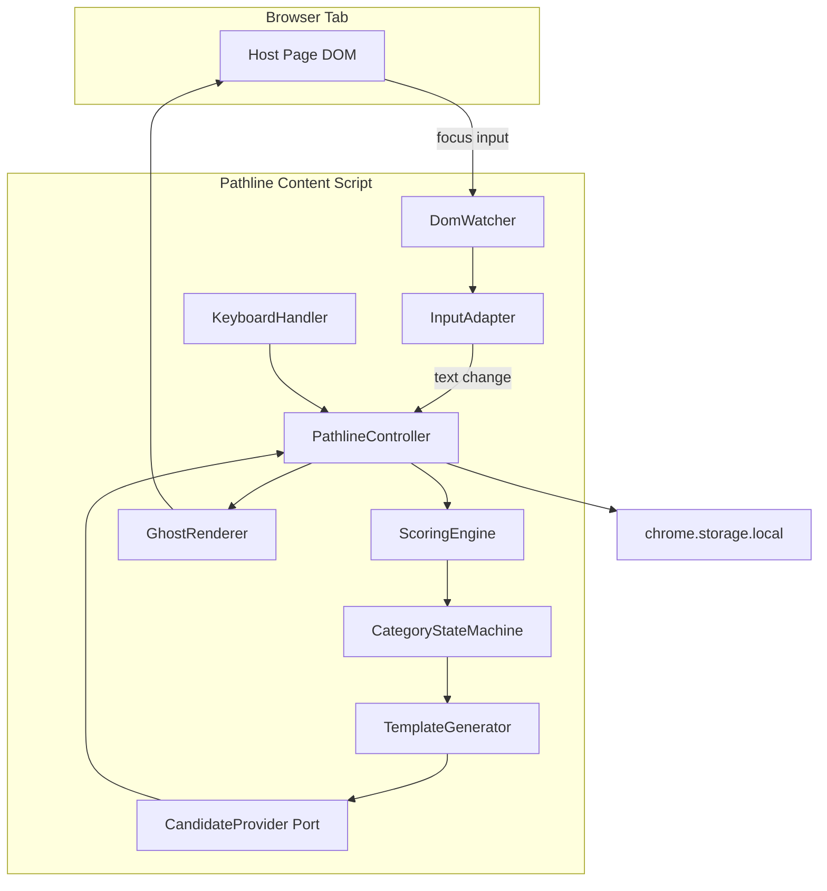
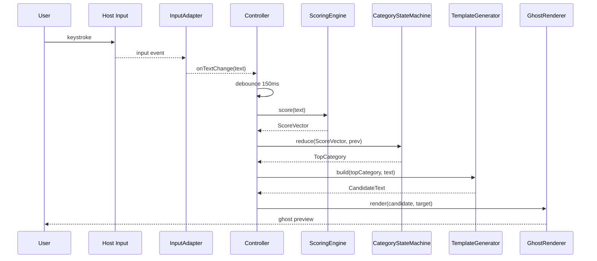
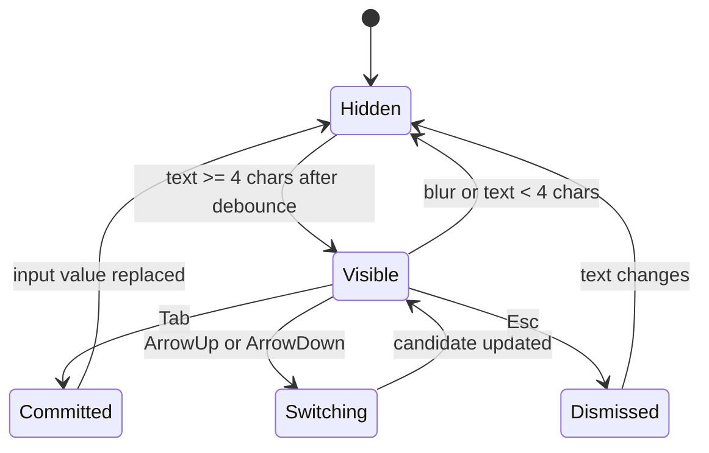

# Technical Design — Pathline Input Assistant

## Overview

**Purpose**: Pathline は、ユーザーが Web 上の入力欄に打ち込んだ雑なテキストをルールベースで 5 カテゴリ (Improve / Summarize / Clarify / Structure / Review) に分類し、LLM 向けの依頼文テンプレートをインラインゴーストとして提示する Chrome 拡張機能である。

**Users**: LLM をブラウザで高頻度に利用するエンジニア・企画職・ライター等のナレッジワーカーが、入力欄上で Tab / Arrow / Esc だけで候補確定・切替・破棄を行う。

**Impact**: 既存の Web ページに対して Content Script を注入し、非侵襲のオーバーレイ/インラインゴースト表示層を追加する。ページ本体の DOM / 値を候補確定時まで変更しない。

### Goals
- 要件 1〜7 をすべて満たす MVP 実装の合意形成
- Scoring Engine と Category State Machine を疎結合にし、将来の AI 候補生成差し替えに耐える構造を提供
- 体感 100ms 以下 (debounce 150ms + 処理 20ms 予算) での候補描画
- 外部通信ゼロ・ローカル完結のプライバシー保証

### Non-Goals
- 外部 LLM API / クラウド同期 / ログイン / 課金 (Phase 2 以降)
- サイト別最適化 (ChatGPT / Claude 等の特殊 DOM 対応)
- 高度設定 UI、カスタムテンプレ、ユーザー辞書
- モバイル Chrome / 非 Chromium ブラウザ対応

## Architecture

### Architecture Pattern & Boundary Map

**選定パターン**: Layered Modular Monolith (Content Script 単一バンドル内のレイヤード疎結合)。  
**採用理由**: MV3 準拠、外部通信不要、将来 `CandidateProvider` を非同期 AI 実装に差し替え可能な Ports & Adapters 型の境界を持つ (詳細は `research.md` Decision: レイヤード疎結合アーキテクチャ)。



**Architecture Integration**:
- Selected pattern: Layered Modular Monolith + Ports & Adapters (`CandidateProvider`, `InputTarget`, `GhostRenderer` が交換可能な境界)
- Domain/feature boundaries: DOM 層 / 判定層 / 表示層 / 入力層 を明確分離
- New components rationale: 6 レイヤー構成は要件 8.1 (Scoring と State の疎結合) を直接実現
- Steering compliance: `.kiro/steering/structure.md`, `tech.md` はテンプレート段階だが、TypeScript strict / 型安全 / ローカル処理優先という本 CLAUDE.md の規約に整合

### Technology Stack

| Layer | Choice / Version | Role in Feature | Notes |
|-------|------------------|-----------------|-------|
| Runtime | Chrome Extension Manifest V3 | Content Script の実行基盤 | `host_permissions: ["<all_urls>"]`, `permissions: ["storage"]` |
| Language | TypeScript 5.x (strict) | 全ソース | `any` 禁止、`noUncheckedIndexedAccess` 有効 |
| Bundler | Vite 5.x + `@crxjs/vite-plugin` | Content Script / manifest ビルド | HMR 対応 |
| UI | Vanilla DOM + CSS (Shadow DOM 不使用) | ゴースト表示 | 高 specificity + 名前空間クラス `pl-*` で衝突回避 |
| Storage | `chrome.storage.local` | 将来設定用 (MVP は未使用) | 外部通信なし |
| Testing | Vitest + @testing-library/dom + Playwright (任意) | Unit / DOM Integration / E2E | `happy-dom` or `jsdom` |
| Lint/Format | ESLint (typescript-eslint) + Prettier | 品質ゲート | CI 必須 |

> 詳細トレードオフは `research.md` 参照。

## System Flows

### 入力からゴースト描画までのシーケンス



### キーボード操作の状態遷移



- Esc 後は同一入力内容のまま再表示しない (要件 6.4) — `Dismissed` は現在の text ハッシュを保持し、次に text が変わるまで抑制。
- 候補非表示時の Tab / Arrow / Esc はネイティブ動作 (要件 6.5) — Handler は `visible===true` のときのみ `preventDefault`。

## Requirements Traceability

| Requirement | Summary | Components | Interfaces | Flows |
|-------------|---------|------------|------------|-------|
| 1.1 | textarea / contenteditable の監視開始 | DomWatcher, InputAdapter | `DomWatcher.start`, `InputAdapter.attach` | — |
| 1.2 | DOM 動的追加への追従 | DomWatcher | MutationObserver | — |
| 1.3 | blur で候補非表示 | Controller, GhostRenderer | `Controller.onBlur` | 状態遷移 |
| 1.4 | password / 除外対象は監視しない | DomWatcher | `isEligible(el)` | — |
| 1.5 | サイト非依存 | Content Script manifest | `matches: ["<all_urls>"]` | — |
| 2.1 | 120–200ms debounce でスコア実行 | Controller | `debounce(150)` | 入力シーケンス |
| 2.2–2.11 | 5 カテゴリへのスコア加算ルール | ScoringEngine | `score(text): ScoreVector` | — |
| 3.1 | スコア差 ≥2 または 2 連続優勢で切替 | CategoryStateMachine | `reduce(vec, prev)` | — |
| 3.2 | 明示キーワードで即切替 | ScoringEngine, CategoryStateMachine | `ScoreVector.explicit` flag | — |
| 3.3 | 同カテゴリ内で文面のみ洗練 | TemplateGenerator | `build(cat, text)` | — |
| 3.4 | 初期はトップスコア採用 | CategoryStateMachine | initial state | — |
| 4.1–4.5 | カテゴリ別基本テンプレ | TemplateGenerator, `categories.ts` | `CategoryDefinition` | — |
| 4.6 | `---` 区切りで text 埋込 | TemplateGenerator | `build` | — |
| 5.1 | 入力欄内/直下にゴースト 1 件 | GhostRenderer | `render(candidate)` | — |
| 5.2 | 並列表示しない | GhostRenderer | 単一 DOM ノード管理 | — |
| 5.3 | 同一候補は再描画しない | GhostRenderer | dirty check (hash) | — |
| 5.4 | 4 文字未満は非表示 | Controller | `MIN_LENGTH=4` | — |
| 5.5 | 体感 100ms | Controller, GhostRenderer | 予算 debounce150+処理20ms | — |
| 6.1 | Tab で確定・反映 | KeyboardHandler, InputAdapter | `commit(candidate)` | 状態遷移 |
| 6.2 | ArrowDown で次点切替 | KeyboardHandler, CategoryStateMachine | `cycle(+1)` | — |
| 6.3 | ArrowUp で前候補 | KeyboardHandler, CategoryStateMachine | `cycle(-1)` | — |
| 6.4 | Esc 閉じ・同入力で再表示しない | KeyboardHandler, Controller | `dismiss(hash)` | 状態遷移 |
| 6.5 | 候補非表示時はネイティブ動作 | KeyboardHandler | guard on `visible` | — |
| 7.1 | 外部送信なし | 全体 | manifest に `host_permissions` のみ、通信 API 非使用 | — |
| 7.2 | ローカル同期完結 | ScoringEngine, TemplateGenerator | 純関数 | — |
| 7.3 | 差分小は再評価スキップ | Controller | diff guard | — |
| 7.4 | MV3 準拠 | manifest.json | `manifest_version: 3` | — |
| 7.5 | 設定は `storage.local` のみ | (将来) SettingsStore | — | — |
| 8.1 | Scoring と State の疎結合 | ScoringEngine, CategoryStateMachine | 純関数 + 独立 State | — |
| 8.2 | カテゴリ/テンプレ差し替え可能 | `categories.ts` | `CategoryDefinition[]` | — |
| 8.3 | 非同期候補差し替え可能 | CandidateProvider Port | `CandidateProvider` interface | — |

## Components and Interfaces

| Component | Domain/Layer | Intent | Req Coverage | Key Dependencies | Contracts |
|-----------|--------------|--------|--------------|------------------|-----------|
| DomWatcher | DOM | 対象入力欄の検出・監視開始 | 1.1, 1.2, 1.4, 1.5 | MutationObserver (P0) | Service |
| InputAdapter | DOM | textarea/contenteditable 統一 API | 1.1, 6.1 | DomWatcher (P0) | Service, State |
| ScoringEngine | Logic | ルールベース 5 カテゴリスコアリング | 2.1–2.11, 3.2 | — | Service |
| CategoryStateMachine | Logic | トップカテゴリ安定化と切替 | 3.1, 3.2, 3.4, 6.2, 6.3 | ScoringEngine output (P0) | Service, State |
| TemplateGenerator | Logic | カテゴリ別候補文生成 | 4.1–4.6, 3.3 | `categories.ts` (P0) | Service |
| CandidateProvider (Port) | Logic | 候補生成の抽象化 (MVP: rule-based 実装) | 8.3 | TemplateGenerator (P0) | Service |
| GhostRenderer | View | ゴースト表示の描画/消去 | 5.1–5.5, 1.3 | InputAdapter (P0) | Service, State |
| KeyboardHandler | Input | Tab/Arrow/Esc のキー処理 | 6.1–6.5 | Controller (P0) | Service |
| PathlineController | Orchestration | 全レイヤー結線・debounce・dismiss 管理 | 2.1, 5.4, 5.5, 6.4, 7.3 | 全モジュール (P0) | Service, State |

### DOM Layer

#### DomWatcher

| Field | Detail |
|-------|--------|
| Intent | ページ内の対象入力欄を検出し、Controller に登録/解除イベントを発行 |
| Requirements | 1.1, 1.2, 1.4, 1.5 |

**Responsibilities & Constraints**
- `document` 全体をスキャンし `textarea` と `[contenteditable="true"]` を列挙
- `MutationObserver` で動的追加/削除を検知
- 除外判定: `input[type=password]`, `data-pathline="off"`, `aria-hidden="true"` 祖先を持つ要素
- 要素単位の監視は 1 つにつき 1 度だけ登録 (WeakSet で重複防止)

**Dependencies**
- Outbound: InputAdapter — 入力欄ラッパ生成 (P0)
- External: `MutationObserver` — DOM 変化監視 (P0)

**Contracts**: Service ☑ / State ☐ / API ☐ / Event ☐ / Batch ☐

##### Service Interface
```typescript
interface DomWatcher {
  start(): void;
  stop(): void;
  onAttach(listener: (target: InputTarget) => void): Disposable;
  onDetach(listener: (target: InputTarget) => void): Disposable;
}

interface Disposable {
  dispose(): void;
}
```
- Preconditions: `document.readyState !== "loading"` (loading 時は `DOMContentLoaded` 待ち)
- Postconditions: 登録済み要素には `data-pl-attached="1"` 属性が付与される
- Invariants: 同一要素に対して `attach` は 1 度のみ発火

**Implementation Notes**
- Integration: Controller 起点で `start()`。ページ遷移を伴わない SPA ナビは MutationObserver でカバー。
- Validation: `isEligible(el)` を単体テスト (password / data-pathline=off / 通常 textarea)。
- Risks: iframe 内の入力欄は MVP 範囲外 (将来 `all_frames: true` 検討)。

#### InputAdapter

| Field | Detail |
|-------|--------|
| Intent | textarea と contenteditable の値取得/書込/キャレット操作を統一 API 化 |
| Requirements | 1.1, 6.1 |

**Responsibilities & Constraints**
- `getText()` / `setText(value)` / `getCaret()` / `focus()` の統一 API を提供
- `onInput` / `onBlur` / `onFocus` を購読可能
- 書込時は `input` イベントをディスパッチし host 側バリデーション/React 等の state 反映を促す

**Dependencies**
- Inbound: DomWatcher (P0)
- Outbound: PathlineController (P0)

**Contracts**: Service ☑ / State ☑

##### Service Interface
```typescript
type InputTargetKind = "textarea" | "contenteditable";

interface InputTarget {
  readonly kind: InputTargetKind;
  readonly element: HTMLElement;
  getText(): string;
  setText(value: string): void;
  getCaretOffset(): number;
  focus(): void;
  onInput(listener: (text: string) => void): Disposable;
  onBlur(listener: () => void): Disposable;
  onFocus(listener: () => void): Disposable;
}
```
- Preconditions: `element` は DomWatcher の eligibility を通過済み
- Postconditions: `setText` 後、`input` イベントが dispatch される
- Invariants: `kind` は生成時に確定し変化しない

**Implementation Notes**
- Integration: textarea は `HTMLTextAreaElement.value` と `selectionStart` を使用。contenteditable は `Selection` API と `textContent` を使用。
- Validation: IME 変換中 (`compositionstart`→`compositionend`) は `onInput` 発火を抑止。
- Risks: React 管理の textarea では `nativeInputValueSetter` を使わないと state が同期しない。対策として `Object.getOwnPropertyDescriptor` 経由で setter を取得。

### Logic Layer

#### ScoringEngine

| Field | Detail |
|-------|--------|
| Intent | 入力文字列から 5 カテゴリの数値スコアと明示フラグを算出する純関数 |
| Requirements | 2.1–2.11, 3.2 |

**Responsibilities & Constraints**
- 入力文字列に対し 1 パスで全ルール評価 (O(n))
- 明示キーワード検出時は `explicit: true` を付与し、State Machine の安定化ルールを bypass 可能にする
- 外部依存なし (純関数) — 単体テストで全ルールを網羅

**Dependencies**
- 外部依存なし

**Contracts**: Service ☑

##### Service Interface
```typescript
type CategoryId = "improve" | "summarize" | "clarify" | "structure" | "review";

type ScoreVector = Readonly<Record<CategoryId, number>> & {
  readonly explicit: boolean;
  readonly topCategory: CategoryId;
};

interface ScoringEngine {
  score(text: string): ScoreVector;
}
```
- Preconditions: `text` は正規化済み (NFC)。長さ制限なし (ただし > 10_000 文字の場合は先頭 10_000 のみ評価)
- Postconditions: スコアは全カテゴリで 0 以上、`topCategory` は最高スコア (同点時は定義順: improve < summarize < clarify < structure < review の逆優先で決定論的に選択)
- Invariants: 同一入力に対して常に同一 ScoreVector (参照透過)

**Implementation Notes**
- Integration: ルール定義は `scoring/rules.ts` に `Rule = { match: (t) => number; category: CategoryId; explicit?: boolean }` の配列として保持。
- Validation: 要件 2.2–2.11 の各ルールに対応した Unit Test (UT-101 〜 UT-111) 必須。
- Risks: 日本語の曖昧キーワード (「直して」) は部分一致で誤爆の可能性 — MVP では単純 `includes` で許容し、計測して調整。

#### CategoryStateMachine

| Field | Detail |
|-------|--------|
| Intent | トップカテゴリの安定化切替 (スコア差 ≥2 / 2 連続優勢 / 明示 bypass) と手動 cycle |
| Requirements | 3.1, 3.2, 3.4, 6.2, 6.3 |

**Responsibilities & Constraints**
- 現トップカテゴリと challenger カウントを保持
- Arrow 操作による手動 cycle (次点/前候補) は State を上書きし、以降の debounce 評価でも維持 (次の明示キーワード検出までは手動優先)
- 入力欄ごとに独立した State を保持 (Controller が `Map<element, StateMachine>` を管理)

**Dependencies**
- Inbound: PathlineController (P0)

**Contracts**: Service ☑ / State ☑

##### Service Interface
```typescript
interface CategoryStateMachine {
  reduce(vec: ScoreVector): CategoryId;
  cycle(direction: 1 | -1): CategoryId;
  reset(): void;
  readonly current: CategoryId;
}
```
- Preconditions: `reduce` は debounce 後に 1 入力 1 回呼ばれる
- Postconditions: `current` は以下のいずれかの規則で決定される:
  1. 初期: `vec.topCategory`
  2. `vec.explicit === true`: 即 `vec.topCategory` に切替、challenger カウントリセット
  3. `vec.topCategory !== current` かつ `(vec[top] - vec[current]) >= 2`: 切替
  4. `vec.topCategory !== current` が 2 連続: 切替
  5. それ以外: 維持
- Invariants: `current` は常に有効な `CategoryId`

**Implementation Notes**
- Integration: `cycle()` は要件 6.2/6.3 用。順序配列 `["improve","summarize","clarify","structure","review"]` を循環。
- Validation: 状態遷移テーブルを網羅する Unit Test (UT-201 〜 UT-208)。
- Risks: 手動 cycle 後の自動切替ポリシーが曖昧 → 「手動選択は次の明示キーワード入力または blur までロック」と明文化。

#### TemplateGenerator

| Field | Detail |
|-------|--------|
| Intent | カテゴリと入力テキストから候補文を生成する純関数 |
| Requirements | 4.1–4.6, 3.3 |

**Responsibilities & Constraints**
- `categories.ts` の `CategoryDefinition` からテンプレ取得
- 入力を `---\n{text}\n---` で挟み込む (4.6)
- 同カテゴリで text が変わった場合は同じテンプレ枠組みで文面のみ更新 (3.3)

**Dependencies**
- Outbound: `categories.ts` (静的定義, P0)

**Contracts**: Service ☑

##### Service Interface
```typescript
interface CategoryDefinition {
  readonly id: CategoryId;
  readonly label: string;
  readonly template: string;
}

interface TemplateGenerator {
  build(category: CategoryId, text: string): string;
}
```
- Preconditions: `text.length > 0`
- Postconditions: 返却値は `template + "\n---\n" + text + "\n---"` 形式
- Invariants: 未知の `category` は型で排除 (discriminated union)

**Implementation Notes**
- Integration: `CandidateProvider` (MVP 実装) が内部で使用。
- Validation: 5 カテゴリ × 境界値 (空文字 / 長文 / 改行含) の Unit Test。
- Risks: テンプレ文面が将来変わる場合、UI 表示のコピペにも影響 → 定数を 1 箇所 (`categories.ts`) に集約。

#### CandidateProvider (Port)

| Field | Detail |
|-------|--------|
| Intent | 候補生成の抽象化ポート。MVP は同期ルールベース、将来は非同期 AI 実装に差し替え可能 |
| Requirements | 8.3 |

**Contracts**: Service ☑

##### Service Interface
```typescript
interface CandidateRequest {
  readonly category: CategoryId;
  readonly text: string;
}

interface Candidate {
  readonly category: CategoryId;
  readonly body: string;
  readonly hash: string;
}

interface CandidateProvider {
  provide(req: CandidateRequest): Candidate | Promise<Candidate>;
}
```
- Preconditions: `req.text.length >= 4`
- Postconditions: `hash` は `body` に対して決定的 (5.3 の再描画抑止に使用)
- Invariants: Promise を返す実装でも Controller は同じ結線で扱える

**Implementation Notes**
- Integration: MVP 実装 `RuleBasedCandidateProvider` は内部で `TemplateGenerator` を呼ぶ。
- Risks: Promise 実装時は race condition に注意 → Controller 側で最新リクエスト ID で破棄制御。

### View Layer

#### GhostRenderer

| Field | Detail |
|-------|--------|
| Intent | 入力欄上/直下に候補文をゴースト表示し、blur/change/dismiss で消去 |
| Requirements | 5.1–5.5, 1.3 |

**Responsibilities & Constraints**
- 戦略パターンで 2 実装を提供:
  - `TextareaOverlayRenderer`: `position: absolute` な div を textarea と同スタイルで重ね、未入力部分に薄色でテキスト描画
  - `ContentEditableInlineRenderer`: 末尾に `span.pl-ghost[contenteditable=false]` を挿入
- 同一 `candidate.hash` なら再描画しない (5.3)
- text 長 < 4 では `hide()` 呼び出し (5.4 は Controller 判定 + Renderer 副作用)
- 1 インスタンスにつき 1 ゴーストのみ保持 (5.2)

**Dependencies**
- Inbound: PathlineController (P0)
- Outbound: InputAdapter (P0)

**Contracts**: Service ☑ / State ☑

##### Service Interface
```typescript
interface GhostRenderer {
  render(target: InputTarget, candidate: Candidate): void;
  hide(target: InputTarget): void;
  isVisible(target: InputTarget): boolean;
}
```
- Preconditions: `target.element.isConnected === true`
- Postconditions: 同一 `candidate.hash` の連続呼び出しは no-op (再描画なし)
- Invariants: 1 target に 1 ghost 要素

**Implementation Notes**
- Integration: textarea overlay は `getComputedStyle` でフォント/パディング/border を複製。`resize` / `scroll` / `window.resize` イベントで再レイアウト。
- Validation: DOM Integration Test で描画位置と hash 再描画抑止を検証 (IT-301 〜 IT-305)。
- Risks: host CSS の `position: relative` 欠如で overlay がずれる → 親に `position: relative` を一時付与する fallback を検討 (副作用になるため ship 前に計測)。

### Input Layer

#### KeyboardHandler

| Field | Detail |
|-------|--------|
| Intent | 候補表示中の Tab / Arrow / Esc を捕捉し Controller に委譲。非表示時はパススルー |
| Requirements | 6.1–6.5 |

**Contracts**: Service ☑

##### Service Interface
```typescript
type KeyAction =
  | { type: "commit" }
  | { type: "cycle"; direction: 1 | -1 }
  | { type: "dismiss" };

interface KeyboardHandler {
  attach(target: InputTarget): Disposable;
  onAction(listener: (action: KeyAction) => void): Disposable;
}
```
- Preconditions: `attach` は GhostRenderer のライフサイクルと連動
- Postconditions: visible 時のみ `preventDefault` + `stopImmediatePropagation`。非 visible 時は何もしない (6.5)
- Invariants: IME 変換中 (`isComposing === true`) は Tab/Arrow/Esc を抑止しない

**Implementation Notes**
- Integration: `keydown` capture phase で購読。visible 判定は Controller から提供される getter を注入。
- Validation: IME 中 / 非表示時 / 表示時の 3 系統で Unit Test (UT-401 〜 UT-406)。
- Risks: Google Docs 等のグローバルキー奪取ページでは capture の順序問題あり → MVP では許容し既知制約に明記。

### Orchestration Layer

#### PathlineController

| Field | Detail |
|-------|--------|
| Intent | 全レイヤーの結線、debounce、入力差分ガード、dismiss ハッシュ管理 |
| Requirements | 2.1, 5.4, 5.5, 6.4, 7.3 |

**Responsibilities & Constraints**
- 入力欄 1 件につき 1 セッション (state machine / renderer / handler) を保持
- debounce は 150ms 固定。ただし明示キーワード検出時は debounce 短縮 (50ms) で即応 (要件の "Enter/句点/疑問符/明示キーワードは即更新" を実現)
- `lastEvaluatedText` との diff ≤ 1 かつ構造記号 (改行/記号) 変化なしなら評価スキップ (7.3)
- Esc 後は `dismissedHash = sha1(text)` を保持し、`text` が変わるまで再表示しない (6.4)

**Contracts**: Service ☑ / State ☑

##### Service Interface
```typescript
interface PathlineController {
  bootstrap(): void;
  teardown(): void;
}
```
- Invariants: 1 Content Script = 1 Controller インスタンス

**Implementation Notes**
- Integration: エントリポイント `content.ts` で `new PathlineController(deps).bootstrap()`。
- Validation: 入力→debounce→描画の統合テストで 100ms 予算を計測 (PT-001)。
- Risks: 長文入力時のスコアリング O(n) コスト → 10_000 文字で先頭切出し。

## Data Models

### Domain Model

本機能はサーバー永続化を持たない。主要な in-memory データは以下:

- `InputTarget` (値オブジェクト): 監視中の入力欄ラッパ
- `ScoreVector` (値オブジェクト): 1 回の評価結果
- `CategoryState` (エンティティ): 入力欄ごとのトップカテゴリと challenger カウント
- `Candidate` (値オブジェクト): 描画対象の候補文 + hash
- `CategoryDefinition` (静的マスタ): `categories.ts` のハードコード配列

### Logical Data Model

```typescript
type CategoryId = "improve" | "summarize" | "clarify" | "structure" | "review";

interface ScoreVector {
  readonly improve: number;
  readonly summarize: number;
  readonly clarify: number;
  readonly structure: number;
  readonly review: number;
  readonly explicit: boolean;
  readonly topCategory: CategoryId;
}

interface CategoryState {
  current: CategoryId;
  challengerCount: number;
  manualLock: boolean; // Arrow 手動選択後、次の explicit または blur まで true
}

interface Candidate {
  readonly category: CategoryId;
  readonly body: string;
  readonly hash: string; // body の FNV-1a 32bit ハッシュ hex
}
```

**Consistency & Integrity**:
- Controller が入力欄ごとの `CategoryState` を `WeakMap<HTMLElement, CategoryState>` で保持。element GC 時に自動解放。
- 永続化なし (MVP)。将来 `chrome.storage.local` にユーザー辞書を保存する場合は、スキーマバージョンを `v` フィールドで管理。

### Data Contracts & Integration

MVP では外部サービスとのデータ契約なし (要件 7.1)。将来の `CandidateProvider` 非同期実装に備え、`Candidate` の `hash` を再描画抑止キーとして公開する。

## Error Handling

### Error Strategy
- **Fail-silent 原則**: 拡張機能起因のエラーは host ページの体験を壊さない。例外は `try/catch` で握り、`console.warn("[pathline]", ...)` で debug 出力のみ行う。
- ゴースト描画失敗時は `hide()` して次の入力まで再試行しない。
- InputAdapter の `setText` 失敗 (Read-only 要素等) は candidate 確定を諦めゴーストのみ消す。

### Error Categories and Responses
- **User Errors (該当なし)**: ユーザー入力に対する明示的なエラー UI は出さない (フロー非中断)。
- **System Errors**:
  - DOM が期待形状でない (null selector 等) → 当該要素の監視を解除し `console.warn`。
  - `getComputedStyle` 失敗 → overlay fallback として非表示。
- **Business Logic Errors (該当なし)**: スコアリング/テンプレは純関数で例外パス無し。

### Monitoring
- `performance.mark("pathline:score:start|end")` / `"pathline:render:start|end"` で処理時間を計測 (dev ビルドのみ `console.table` 出力)。
- 本番では計測を無効化し、`NODE_ENV === "development"` ガードで切替。

## Testing Strategy

### テスト方針
- ロジック層 (Scoring / State / Template) は純関数/決定論であり、網羅単体テストを必須とする。
- DOM 層 (Adapter / Renderer / Handler) は happy-dom 上の DOM Integration Test で検証。
- E2E は Playwright で 2 シナリオ (textarea / contenteditable) を最低限実行。
- テストデータ戦略: 代表入力文 (要件 2 の全ルール網羅) をフィクスチャ化。

### 1. Unit Tests

| テストID | テスト対象 | テスト観点 | テストケース | 入力値 | 期待結果 | 優先度 |
|----------|-----------|-----------|-------------|-------|---------|-------|
| UT-101 | ScoringEngine.score | 正常系 | 120 文字超 | 文字数 130 | summarize +3, structure +1 | High |
| UT-102 | ScoringEngine.score | 正常系 | 改行含む | "a\nb" | structure +2 | High |
| UT-103 | ScoringEngine.score | 正常系 | `?` 含む | "どう？" | clarify +2 | High |
| UT-104 | ScoringEngine.score | 正常系 | 曖昧改善語 | "いい感じに直して" | improve +3 | High |
| UT-105 | ScoringEngine.score | 正常系 | 明示「要約」 | "これを要約" | summarize +5, explicit=true | High |
| UT-106 | ScoringEngine.score | 正常系 | 「レビュー」 | "レビューして" | review +5, explicit=true | High |
| UT-107 | ScoringEngine.score | 正常系 | 「整理」 | "整理して" | structure +4, explicit=true | High |
| UT-108 | ScoringEngine.score | 正常系 | 「どう思う」 | "これどう思う" | clarify +3, explicit=true | High |
| UT-109 | ScoringEngine.score | 正常系 | コード記号 | "fn() { }" | review +3 | High |
| UT-110 | ScoringEngine.score | 境界値 | 空文字 | "" | 全カテゴリ 0 | Med |
| UT-111 | ScoringEngine.score | 境界値 | 10_001 文字 | 超長文 | 先頭 10_000 のみ評価 | Med |
| UT-201 | CategoryStateMachine.reduce | 正常系 | 初期 | top=summarize vec | current=summarize | High |
| UT-202 | CategoryStateMachine.reduce | 正常系 | スコア差 ≥2 で切替 | current=improve, vec(summarize+3 vs improve+1) | current=summarize | High |
| UT-203 | CategoryStateMachine.reduce | 正常系 | 2 連続優勢で切替 | 2 回連続 summarize top | current=summarize | High |
| UT-204 | CategoryStateMachine.reduce | 異常系 | 差<2 かつ 1 回のみ | 維持 | current 維持 | High |
| UT-205 | CategoryStateMachine.reduce | 正常系 | explicit=true bypass | explicit | 即切替 | High |
| UT-206 | CategoryStateMachine.cycle | 正常系 | +1 | current=improve | current=summarize | Med |
| UT-207 | CategoryStateMachine.cycle | 正常系 | -1 循環 | current=improve | current=review | Med |
| UT-208 | CategoryStateMachine | 状態遷移 | manualLock 解除 | explicit 入力 | manualLock=false | Med |
| UT-301 | TemplateGenerator.build | 正常系 | improve | text="hello" | "以下の文章...\n---\nhello\n---" | High |
| UT-302 | TemplateGenerator.build | 正常系 | 全 5 カテゴリ | 各 id | 対応テンプレ | High |
| UT-303 | TemplateGenerator.build | 境界値 | 改行含 text | "a\nb" | `---` で正しく囲む | Med |
| UT-401 | KeyboardHandler | 正常系 | Tab 表示中 | visible=true | commit action, preventDefault | High |
| UT-402 | KeyboardHandler | 正常系 | Tab 非表示 | visible=false | ネイティブ動作 (no preventDefault) | High |
| UT-403 | KeyboardHandler | 正常系 | Arrow 切替 | ArrowDown visible | cycle(+1) | High |
| UT-404 | KeyboardHandler | 正常系 | Esc dismiss | Esc visible | dismiss action | High |
| UT-405 | KeyboardHandler | 異常系 | IME 中 | isComposing=true | 何もしない | High |

**観点チェック**: 正常系 / 異常系 / 境界値 / 型バリデーション / 状態遷移 ✓

### 2. Integration Tests

| テストID | テスト対象 | 連携 | シナリオ | 前提 | 期待 | 優先度 |
|----------|-----------|------|----------|------|------|-------|
| IT-301 | GhostRenderer + InputAdapter (textarea) | DOM | 描画→hide | textarea focus | overlay 表示/消去 | High |
| IT-302 | GhostRenderer + InputAdapter (contenteditable) | DOM | 描画→hide | div[contenteditable] | inline span 挿入/削除 | High |
| IT-303 | GhostRenderer | 再描画抑止 | 同一 hash 2 回 | render(x2) | 2 回目 no-op | High |
| IT-304 | Controller + DomWatcher | MutationObserver | 動的追加 textarea | 後追加 | attach 発火 | High |
| IT-305 | Controller | debounce + dismiss | Esc 後同一 text | Esc | 再表示されない | High |
| IT-306 | InputAdapter (textarea) | React 管理 textarea | setText | React controlled | value 反映 + input 発火 | Med |
| IT-307 | Controller | password 除外 | input[type=password] | attach しない | High |

**観点チェック**: DOM CRUD / イベント / React 統合 / 認可なし ✓

### 3. E2E Tests

| テストID | シナリオ | 前提 | 手順 | 期待 | 優先度 |
|----------|---------|------|------|------|-------|
| E2E-001 | textarea で Improve 候補を Tab 確定 | 拡張インストール済み | 1. textarea focus<br>2. "これいい感じに直して" 入力<br>3. 150ms 待機<br>4. Tab | textarea.value が候補全文に置換 | High |
| E2E-002 | contenteditable で ArrowDown 切替→Esc | 同上 | 1. div[contenteditable] focus<br>2. "議事録..." 入力 (120字超)<br>3. ArrowDown<br>4. Esc | 候補がクリアされ同一 text で再表示なし | High |

### 4. Manual Tests

| テストID | 確認項目 | 内容 | 環境 | 期待 | 優先度 |
|----------|---------|------|------|------|-------|
| MT-001 | ゴースト位置 | textarea スクロール時追従 | Chrome latest | overlay ズレなし | High |
| MT-002 | ゴースト装飾 | 薄色・非選択 | Chrome latest | user-select:none / 半透明 | High |
| MT-003 | ブラウザ互換 | Edge / Brave | Chromium 系 | 同等動作 | Med |
| MT-004 | アクセシビリティ | スクリーンリーダーに読み上げさせない | NVDA | `aria-hidden="true"` で無視 | Med |
| MT-005 | 日本語表示 | テンプレ文言 | ja | 崩れなし | High |

### 5. Performance Tests

| テストID | 対象 | 測定 | 目標 | 条件 |
|----------|------|------|------|------|
| PT-001 | Controller (score→render) | debounce 後の処理時間 | < 20ms | 1000 文字入力, Chrome dev |
| PT-002 | GhostRenderer | 再描画抑止 | 同一 hash で 0 DOM 書込 | IT-303 併用計測 |

### テストカバレッジ目標

| レベル | 目標 | 備考 |
|--------|------|------|
| Unit | 90% 以上 | Scoring / State は 100% |
| Integration | 主要 DOM 操作 100% | textarea / contenteditable 両方 |
| E2E | 2 シナリオ | MVP 範囲 |
| Manual | 全 UI 要素 | リリース前必須 |

## Security Considerations

- **外部送信禁止**: `manifest.json` で `host_permissions` を `<all_urls>`、`permissions` を `["storage"]` のみに限定。`fetch` / `XMLHttpRequest` / `WebSocket` は本プロジェクトで import しない (ESLint `no-restricted-globals` で禁止)。
- **XSS 防止**: ゴースト描画は `textContent` のみ使用。`innerHTML` は使わない。
- **パスワード欄除外**: 要件 1.4 準拠。`data-pathline="off"` 属性でユーザ/サイト側からも明示除外可能。
- **CSP**: Content Script は MV3 で `script-src 'self'` が強制されるため、eval / Function コンストラクタを使わない。

## Performance & Scalability

- 目標: debounce 150ms + 処理 20ms 以内 (合計 < 200ms、体感 100ms 感覚)。
- `ScoringEngine` は 10_000 文字で打ち切り (長文切出し)。
- `GhostRenderer` は hash dirty check で同一候補時 0 DOM 書込。
- MutationObserver は `subtree: true, childList: true` で `document.body` のみ監視。Attribute 変更は購読しない (負荷対策)。

## Supporting References

- `research.md` — 技術トレードオフ、アーキテクチャ評価、リスク詳細
- `docs/llm_input_assistant_prd_and_spec.md` — プロダクトビジョンとカテゴリ設計原典
